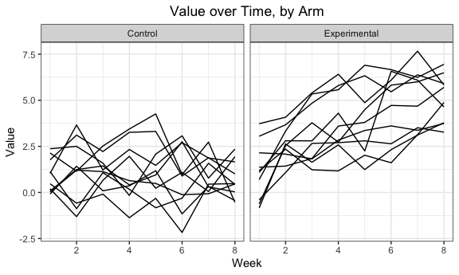

P8105: Data Science I
================
Assignment 5<br>Jimmy Kelliher (UNI: jmk2303)

-   [Problem 2](#problem-2)
-   [Problem 3](#problem-3)

<!------------------------------------------------------------------------------
Preamble
------------------------------------------------------------------------------->
<!------------------------------------------------------------------------------
Problem 1
------------------------------------------------------------------------------->
<!------------------------------------------------------------------------------
Problem 2
------------------------------------------------------------------------------->

# Problem 2

``` r
# create tidy dataset for longitudinal study
longData <-
  # create data frame with file names
  tibble(files = list.files("datasets/longitudinal_study")) %>%
  # add a column where each row contains the contents of the corresponding file
  mutate(raw_data = map(
      .x = files
    , ~read_csv(paste0("datasets/longitudinal_study/", .x))
  )) %>%
  # unnest the nested data frames to create an un-tidied, but usable data frame
  unnest(cols = raw_data) %>%
  # pivot longer via week number
  pivot_longer(
      cols         = starts_with("week_")
    , names_to     = "week"
    , names_prefix = "week_"
  ) %>%
  # separate file name into arm type and subject id; use sensible classes
  mutate(
      arm        = factor(recode(
        substr(files, 1, 3)
      , con = "Control"
      , exp = "Experimental"
    ))
    , subject_id = as.integer(substr(files, 5, 6))
    , week       = as.integer(week)
  ) %>%
  # remove file name column now that it is redundant
  select(  arm, subject_id, week, value) %>%
  # relocate columns by group hierarchy
  relocate(arm, subject_id, week, value)

# output tidied dataset
head(longData, 10) %>% knitr::kable()
```

| arm     | subject\_id | week | value |
|:--------|------------:|-----:|------:|
| Control |           1 |    1 |  0.20 |
| Control |           1 |    2 | -1.31 |
| Control |           1 |    3 |  0.66 |
| Control |           1 |    4 |  1.96 |
| Control |           1 |    5 |  0.23 |
| Control |           1 |    6 |  1.09 |
| Control |           1 |    7 |  0.05 |
| Control |           1 |    8 |  1.94 |
| Control |           2 |    1 |  1.13 |
| Control |           2 |    2 | -0.88 |

``` r
# create a spaghetti chart of the data
longData %>%
  # instantiate plot
  ggplot(aes(x = week, y = value, group = subject_id)) +
  # add lines
  geom_line() +
  # create separate line charts for each arm
  facet_grid(~arm) +
  # add meta-data
  labs(
      title = "Value over Time, by Arm"
    , x     = "Week"
    , y     = "Value"
  )
```



<!------------------------------------------------------------------------------
Problem 3
------------------------------------------------------------------------------->

# Problem 3

``` r
# set seed
set.seed(10)

# edit dataset to introduce missing values
irisMissing <-
  # call dataset
  iris %>% 
  # randomly select 20 entries from each column and assign them missing values
  map_df(~replace(.x, sample(1:150, 20), NA)) %>%
  # convert Species to a character vector
  mutate(Species = as.character(Species))

# write a function to address missing values
replaceMissing <- function(v) {
  # if input vector v is a numeric vector...
  if (is.numeric(v)) {
    # ... replace missing values with the mean of non-missing values
    replace_na(v, mean(v, na.rm = TRUE))
  # if input vector v is a character vector...
  } else if (is.character(v)) {
    # ... replace missing values with the string "virginica"
    replace_na(v, "virginica")
  }
}

# apply function to each column of edited dataset to fill in missing values
irisCorrected <- map_df(irisMissing, replaceMissing)

# output edited dataset
tail(irisMissing, 10) %>% knitr::kable()
```

| Sepal.Length | Sepal.Width | Petal.Length | Petal.Width | Species   |
|-------------:|------------:|-------------:|------------:|:----------|
|          6.7 |         3.1 |          5.6 |         2.4 | virginica |
|          6.9 |         3.1 |          5.1 |         2.3 | virginica |
|           NA |         2.7 |          5.1 |         1.9 | virginica |
|          6.8 |         3.2 |           NA |         2.3 | virginica |
|          6.7 |         3.3 |           NA |         2.5 | virginica |
|          6.7 |         3.0 |          5.2 |         2.3 | virginica |
|          6.3 |         2.5 |          5.0 |         1.9 | NA        |
|          6.5 |         3.0 |          5.2 |         2.0 | NA        |
|           NA |         3.4 |          5.4 |         2.3 | virginica |
|          5.9 |         3.0 |          5.1 |         1.8 | virginica |

``` r
# output corrected dataset
tail(irisCorrected, 10) %>% knitr::kable()
```

| Sepal.Length | Sepal.Width | Petal.Length | Petal.Width | Species   |
|-------------:|------------:|-------------:|------------:|:----------|
|     6.700000 |         3.1 |     5.600000 |         2.4 | virginica |
|     6.900000 |         3.1 |     5.100000 |         2.3 | virginica |
|     5.819231 |         2.7 |     5.100000 |         1.9 | virginica |
|     6.800000 |         3.2 |     3.765385 |         2.3 | virginica |
|     6.700000 |         3.3 |     3.765385 |         2.5 | virginica |
|     6.700000 |         3.0 |     5.200000 |         2.3 | virginica |
|     6.300000 |         2.5 |     5.000000 |         1.9 | virginica |
|     6.500000 |         3.0 |     5.200000 |         2.0 | virginica |
|     5.819231 |         3.4 |     5.400000 |         2.3 | virginica |
|     5.900000 |         3.0 |     5.100000 |         1.8 | virginica |
