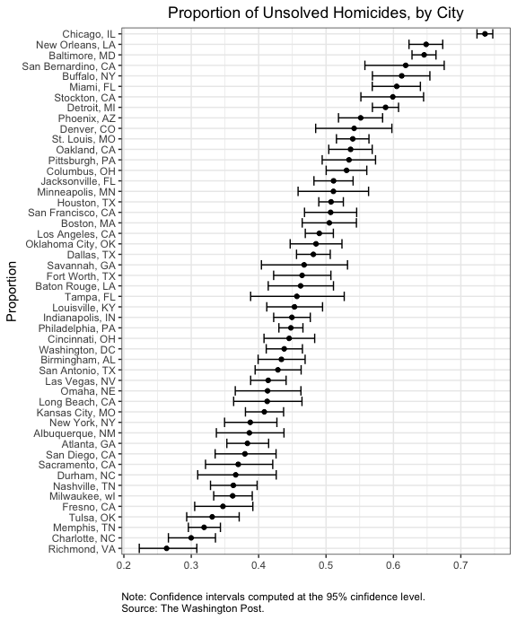

P8105: Data Science I
================
Assignment 5<br>Jimmy Kelliher (UNI: jmk2303)

-   [Problem 1](#problem-1)
-   [Problem 2](#problem-2)
-   [Problem 3](#problem-3)

<!------------------------------------------------------------------------------
Preamble
------------------------------------------------------------------------------->
<!------------------------------------------------------------------------------
Problem 1
------------------------------------------------------------------------------->

# Problem 1

We begin by pulling and tidying data on homicides in 50 of the largest
US cities, courtesy of The Washington Post.

``` r
# identify the proper url for the data
path <- "https://raw.githubusercontent.com/washingtonpost/data-homicides/master/homicide-data.csv"

# pull and tidy data
homicides <-
  # read in data and rename a few anomalous missing values
  read_csv(path, na = c("", "Unknown")) %>%
  # create variables useful for analysis
  mutate(
    # concatenate city and state into a single string variable 
      city_state = paste0(city, ", ", state)
    # create a binary factor variable that indicates if a case was solved
    , resolution = factor(case_when(
        disposition == "Closed by arrest"      ~ "Solved"
      , disposition == "Closed without arrest" ~ "Unsolved"
      , disposition == "Open/No arrest"        ~ "Unsolved"
    ))
  ) %>%
  # remove a row that seems to have an error
  filter(city_state != "Tulsa, AL") %>%
  # relocate city_state to be the first column of our data frame
  relocate(city_state)

# output raw data as table
head(homicides, 10) %>% knitr::kable()
```

| city\_state     | uid        | reported\_date | victim\_last | victim\_first | victim\_race | victim\_age | victim\_sex | city        | state |      lat |       lon | disposition           | resolution |
|:----------------|:-----------|---------------:|:-------------|:--------------|:-------------|------------:|:------------|:------------|:------|---------:|----------:|:----------------------|:-----------|
| Albuquerque, NM | Alb-000001 |       20100504 | GARCIA       | JUAN          | Hispanic     |          78 | Male        | Albuquerque | NM    | 35.09579 | -106.5386 | Closed without arrest | Unsolved   |
| Albuquerque, NM | Alb-000002 |       20100216 | MONTOYA      | CAMERON       | Hispanic     |          17 | Male        | Albuquerque | NM    | 35.05681 | -106.7153 | Closed by arrest      | Solved     |
| Albuquerque, NM | Alb-000003 |       20100601 | SATTERFIELD  | VIVIANA       | White        |          15 | Female      | Albuquerque | NM    | 35.08609 | -106.6956 | Closed without arrest | Unsolved   |
| Albuquerque, NM | Alb-000004 |       20100101 | MENDIOLA     | CARLOS        | Hispanic     |          32 | Male        | Albuquerque | NM    | 35.07849 | -106.5561 | Closed by arrest      | Solved     |
| Albuquerque, NM | Alb-000005 |       20100102 | MULA         | VIVIAN        | White        |          72 | Female      | Albuquerque | NM    | 35.13036 | -106.5810 | Closed without arrest | Unsolved   |
| Albuquerque, NM | Alb-000006 |       20100126 | BOOK         | GERALDINE     | White        |          91 | Female      | Albuquerque | NM    | 35.15111 | -106.5378 | Open/No arrest        | Unsolved   |
| Albuquerque, NM | Alb-000007 |       20100127 | MALDONADO    | DAVID         | Hispanic     |          52 | Male        | Albuquerque | NM    | 35.11178 | -106.7126 | Closed by arrest      | Solved     |
| Albuquerque, NM | Alb-000008 |       20100127 | MALDONADO    | CONNIE        | Hispanic     |          52 | Female      | Albuquerque | NM    | 35.11178 | -106.7126 | Closed by arrest      | Solved     |
| Albuquerque, NM | Alb-000009 |       20100130 | MARTIN-LEYVA | GUSTAVO       | White        |          56 | Male        | Albuquerque | NM    | 35.07538 | -106.5535 | Open/No arrest        | Unsolved   |
| Albuquerque, NM | Alb-000010 |       20100210 | HERRERA      | ISRAEL        | Hispanic     |          43 | Male        | Albuquerque | NM    | 35.06593 | -106.5723 | Open/No arrest        | Unsolved   |

Upon filtering out a single row with a data entry issue, the dataset
consists of 52178 observations and 14 variables, two of which -
`city_state` and `resolution` - we added for convenience. Each row of
the dataset corresponds to a homicide case reported between 2007 and
2017 and includes record of the victim’s name, race/ethnicity, age, and
sex. We also have data on the location of the crime down to the latitude
and longitude, as well as whether the crime was ever solved. Across all
observations, about 50.8% of all homicides were never solved. We aim to
understand the distribution of resolution rates across cities. To that
end, we provide a table of the number of unsolved homicides and the
total number of hommicides for each city.

``` r
# create table of counts and rates of unsolved homicides by city
homicides %>%
  # group by city
  group_by(city_state) %>%
  # summarize data to obtain counts of unsolved homicides and total homicides
  summarize(
      unsolved = sum(resolution == "Unsolved")
    , total    = n()
  ) %>%
  # compute rate of unsolved homicide
  mutate(rate = 100 * unsolved / total) %>%
  # output as readable table
  knitr::kable(
      caption     = "**Count and Rate of Unsolved Homicides, by City**"
    , col.names   = c("City", "Unsolved", "Total", "Rate (in %)")
    , format.args = list(big.mark = ",")
    , d           = 1
  )
```

| City               | Unsolved | Total | Rate (in %) |
|:-------------------|---------:|------:|------------:|
| Albuquerque, NM    |      146 |   378 |        38.6 |
| Atlanta, GA        |      373 |   973 |        38.3 |
| Baltimore, MD      |    1,825 | 2,827 |        64.6 |
| Baton Rouge, LA    |      196 |   424 |        46.2 |
| Birmingham, AL     |      347 |   800 |        43.4 |
| Boston, MA         |      310 |   614 |        50.5 |
| Buffalo, NY        |      319 |   521 |        61.2 |
| Charlotte, NC      |      206 |   687 |        30.0 |
| Chicago, IL        |    4,073 | 5,535 |        73.6 |
| Cincinnati, OH     |      309 |   694 |        44.5 |
| Columbus, OH       |      575 | 1,084 |        53.0 |
| Dallas, TX         |      754 | 1,567 |        48.1 |
| Denver, CO         |      169 |   312 |        54.2 |
| Detroit, MI        |    1,482 | 2,519 |        58.8 |
| Durham, NC         |      101 |   276 |        36.6 |
| Fort Worth, TX     |      255 |   549 |        46.4 |
| Fresno, CA         |      169 |   487 |        34.7 |
| Houston, TX        |    1,493 | 2,942 |        50.7 |
| Indianapolis, IN   |      594 | 1,322 |        44.9 |
| Jacksonville, FL   |      597 | 1,168 |        51.1 |
| Kansas City, MO    |      486 | 1,190 |        40.8 |
| Las Vegas, NV      |      572 | 1,381 |        41.4 |
| Long Beach, CA     |      156 |   378 |        41.3 |
| Los Angeles, CA    |    1,106 | 2,257 |        49.0 |
| Louisville, KY     |      261 |   576 |        45.3 |
| Memphis, TN        |      483 | 1,514 |        31.9 |
| Miami, FL          |      450 |   744 |        60.5 |
| Milwaukee, wI      |      403 | 1,115 |        36.1 |
| Minneapolis, MN    |      187 |   366 |        51.1 |
| Nashville, TN      |      278 |   767 |        36.2 |
| New Orleans, LA    |      930 | 1,434 |        64.9 |
| New York, NY       |      243 |   627 |        38.8 |
| Oakland, CA        |      508 |   947 |        53.6 |
| Oklahoma City, OK  |      326 |   672 |        48.5 |
| Omaha, NE          |      169 |   409 |        41.3 |
| Philadelphia, PA   |    1,360 | 3,037 |        44.8 |
| Phoenix, AZ        |      504 |   914 |        55.1 |
| Pittsburgh, PA     |      337 |   631 |        53.4 |
| Richmond, VA       |      113 |   429 |        26.3 |
| Sacramento, CA     |      139 |   376 |        37.0 |
| San Antonio, TX    |      357 |   833 |        42.9 |
| San Bernardino, CA |      170 |   275 |        61.8 |
| San Diego, CA      |      175 |   461 |        38.0 |
| San Francisco, CA  |      336 |   663 |        50.7 |
| Savannah, GA       |      115 |   246 |        46.7 |
| St. Louis, MO      |      905 | 1,677 |        54.0 |
| Stockton, CA       |      266 |   444 |        59.9 |
| Tampa, FL          |       95 |   208 |        45.7 |
| Tulsa, OK          |      193 |   583 |        33.1 |
| Washington, DC     |      589 | 1,345 |        43.8 |

**Count and Rate of Unsolved Homicides, by City**

Let’s first consider Baltimore, MD in isolation before we generalize our
code to the broader dataset. We want to construct a point estimate and
confidence interval for the true proportion of homicides that went
unsolved.

``` r
# create a summary row
baltimoreSummary <-
  # select data
  homicides %>%
  # restrict to Baltimore
  filter(city_state == "Baltimore, MD") %>%
  # summarize data to obtain counts of unsolved homicides and total homicides
  summarize(
      unsolved = sum(resolution == "Unsolved")
    , total    = n()
  )

# apply summary data to test of proportions and extract relevant output
baltimoreTest <-
  # conduct test of proportions
  prop.test(
    x = pull(baltimoreSummary, unsolved)
  , n = pull(baltimoreSummary, total)
  ) %>%
  # tidy test output
  broom::tidy() %>%
  # extract relevant output
  select(estimate, conf.low, conf.high)

# output findings as table
baltimoreTest %>% knitr::kable()
```

|  estimate |  conf.low | conf.high |
|----------:|----------:|----------:|
| 0.6455607 | 0.6275625 | 0.6631599 |

We find that in Baltimore between the years 2007 and 2017, the
proportion of homicides that went unsolved was about 64.6%, and the 95%
confidence interval around this point estimate was about \[62.8%,
66.3%\]. As we have obtained the desired output, we are now prepared to
construct a function that can generalize this procedure.

``` r
# construct a function to obtain point estimates and confidence intervals
propTestFun <- function(cityData) {

  # create a summary row
  citySummary <-
    # select data
    cityData %>%
    # summarize data to obtain counts of unsolved homicides and total homicides
    summarize(
        unsolved = sum(resolution == "Unsolved")
      , total    = n()
    )

  # apply summary data to test of proportions and extract relevant output
  cityTest <-
    # conduct test of proportions
    prop.test(
      x = pull(citySummary, unsolved)
    , n = pull(citySummary, total)
    ) %>%
    # tidy test output
    broom::tidy() %>%
    # extract relevant output
    select(estimate, conf.low, conf.high)

  # output findings
  cityTest

}

# apply function to nested dataset and un-nest results
cityHomicidesResults <-
  # select original dataset
  homicides %>%
  # nest dataset at the city level
  nest(data = uid:resolution) %>%
  # apply function to each nested city data frame
  mutate(results = map(data, propTestFun)) %>%
  # select relevant features
  select(city_state, results) %>%
  # un-nest results
  unnest(cols = results)

# output results as table
head(cityHomicidesResults, 10) %>% knitr::kable()
```

| city\_state     |  estimate |  conf.low | conf.high |
|:----------------|----------:|----------:|----------:|
| Albuquerque, NM | 0.3862434 | 0.3372604 | 0.4375766 |
| Atlanta, GA     | 0.3833505 | 0.3528119 | 0.4148219 |
| Baltimore, MD   | 0.6455607 | 0.6275625 | 0.6631599 |
| Baton Rouge, LA | 0.4622642 | 0.4141987 | 0.5110240 |
| Birmingham, AL  | 0.4337500 | 0.3991889 | 0.4689557 |
| Boston, MA      | 0.5048860 | 0.4646219 | 0.5450881 |
| Buffalo, NY     | 0.6122841 | 0.5687990 | 0.6540879 |
| Charlotte, NC   | 0.2998544 | 0.2660820 | 0.3358999 |
| Chicago, IL     | 0.7358627 | 0.7239959 | 0.7473998 |
| Cincinnati, OH  | 0.4452450 | 0.4079606 | 0.4831439 |

Using this data frame of results, we can now better visualize the
distribution of proportions, sorted according to the point estimate of
the proportion of unsolved homicides.

``` r
# create error bar chart of rate of unsolved homicide by city
cityHomicidesResults %>%
  # reorder cities according to point estimate of proportion
  mutate(city_state = fct_reorder(city_state, estimate)) %>%
  # instantiate plot
  ggplot(aes(x = city_state, y = estimate)) +
  # add point estimates
  geom_point() +
  # add confidence intervals
  geom_errorbar(aes(ymin = conf.low, ymax = conf.high)) +
  # flip axes for readability
  coord_flip() +
  # add meta-data
  labs(
    title = "Proportion of Unsolved Homicides, by City"
    , x = "Proportion"
    , y = ""
    , caption  = paste0(
          "Note: Confidence intervals computed at the 95% cinfidence level."
        , "\nSource: The Washington Post."
    )
  )
```



Richmond, VA has the lowest rate of unsolved homicides among these 50
cities. Chicago, IL sits at the other extreme of this distribution. In
fact, as its confidence interval does not overlap with that of any other
city, it would appear to be an outlier in this sense.

<!------------------------------------------------------------------------------
Problem 2
------------------------------------------------------------------------------->

# Problem 2

We next consider (ostensibly fictional) data from a longitudinal study
that included a control arm and an experimental arm.

``` r
# create tidy dataset for longitudinal study
longData <-
  # create data frame with file names
  tibble(files = list.files("datasets/longitudinal_study")) %>%
  # add a column where each row contains the contents of the corresponding file
  mutate(raw_data = map(
      .x = files
    , ~read_csv(paste0("datasets/longitudinal_study/", .x))
  )) %>%
  # unnest the nested data frames to create an un-tidied, but usable data frame
  unnest(cols = raw_data) %>%
  # pivot longer via week number
  pivot_longer(
      cols         = starts_with("week_")
    , names_to     = "week"
    , names_prefix = "week_"
  ) %>%
  # separate file name into arm type and subject id; use sensible classes
  mutate(
      arm        = factor(recode(
        substr(files, 1, 3)
      , con = "Control"
      , exp = "Experimental"
    ))
    , subject_id = as.integer(substr(files, 5, 6))
    , week       = as.integer(week)
  ) %>%
  # remove file name column now that it is redundant
  select(  arm, subject_id, week, value) %>%
  # relocate columns by group hierarchy
  relocate(arm, subject_id, week, value)

# output tidied dataset
head(longData, 10) %>% knitr::kable()
```

| arm     | subject\_id | week | value |
|:--------|------------:|-----:|------:|
| Control |           1 |    1 |  0.20 |
| Control |           1 |    2 | -1.31 |
| Control |           1 |    3 |  0.66 |
| Control |           1 |    4 |  1.96 |
| Control |           1 |    5 |  0.23 |
| Control |           1 |    6 |  1.09 |
| Control |           1 |    7 |  0.05 |
| Control |           1 |    8 |  1.94 |
| Control |           2 |    1 |  1.13 |
| Control |           2 |    2 | -0.88 |

Each subject’s weekly values were originally stored as a row vector in
an isolated CSV file. We have tidied the data by iterating over each
file and building a singular dataset wherein each observation in the
dataset is uniquely identified by the arm type (control or
experimental), the subject ID, and the week. It is now a simple task to
visualize the trend of values over time by arm type.

``` r
# create a spaghetti chart of the data
longData %>%
  # instantiate plot
  ggplot(aes(x = week, y = value, group = subject_id)) +
  # add lines
  geom_line() +
  # create separate line charts for each arm
  facet_grid(~arm) +
  # add meta-data
  labs(
      title = "Value over Time, by Arm"
    , x     = "Week"
    , y     = "Value"
  )
```


We see that values for the control arm group trended flat, if not
slightly downward, over the course of the eight weeks of the trial.
While values for the experimental arm group generally started in the
same place as those of the control arm group, the average subject in the
experimental arm group exhibited a linear increase of almost 4 units
over the course of the trial. While not a formal statistical hypothesis
test, this visualization gives us hope that the experimental drug was
effective.

<!------------------------------------------------------------------------------
Problem 3
------------------------------------------------------------------------------->

# Problem 3

Finally, we practice with writing a function whose output is
conditionally dependent on the class of the input. We build our function
below.

``` r
# set seed
set.seed(10)

# edit dataset to introduce missing values
irisMissing <-
  # call dataset
  iris %>% 
  # randomly select 20 entries from each column and assign them missing values
  map_df(~replace(.x, sample(1:150, 20), NA)) %>%
  # convert Species to a character vector
  mutate(Species = as.character(Species))

# write a function to address missing values
replaceMissing <- function(v) {
  # if input vector v is a numeric vector...
  if (is.numeric(v)) {
    # ... replace missing values with the mean of non-missing values
    replace_na(v, mean(v, na.rm = TRUE))
  # if input vector v is a character vector...
  } else if (is.character(v)) {
    # ... replace missing values with the string "virginica"
    replace_na(v, "virginica")
  }
}
```

In order to assess that our function is doing what it’s intended to do,
we first identify some of the problematic rows in our original dataset
and output them below.

``` r
# identify rows in which at least one variable has a missing value
missingRows <- sort(unique(unlist(map(irisMissing, ~which(is.na(.x))))))

# output a few rows of interest in edited dataset
head(irisMissing[missingRows, ], 10) %>%
  knitr::kable(caption = "**Problematic Sample**")
```

| Sepal.Length | Sepal.Width | Petal.Length | Petal.Width | Species |
|-------------:|------------:|-------------:|------------:|:--------|
|          4.6 |         3.1 |          1.5 |          NA | setosa  |
|           NA |         3.4 |          1.4 |         0.3 | setosa  |
|          4.9 |         3.1 |           NA |         0.1 | setosa  |
|          5.4 |          NA |          1.5 |         0.2 | setosa  |
|           NA |          NA |          1.4 |         0.1 | setosa  |
|          4.3 |         3.0 |           NA |         0.1 | setosa  |
|           NA |         4.0 |           NA |         0.2 | setosa  |
|          5.1 |         3.5 |          1.4 |          NA | setosa  |
|          5.1 |         3.8 |          1.5 |          NA | setosa  |
|          5.1 |         3.7 |          1.5 |         0.4 | NA      |

**Problematic Sample**

We conclude by applying our function iteratively to the columns of our
problematic dataset, and we output the result below.

``` r
# apply function to each column of edited dataset to fill in missing values
irisCorrected <- map_df(irisMissing, replaceMissing)

# output a few rows of interest in corrected dataset
head(irisCorrected[missingRows, ], 10) %>%
  knitr::kable(caption = "**Corrected Sample**")
```

| Sepal.Length | Sepal.Width | Petal.Length | Petal.Width | Species   |
|-------------:|------------:|-------------:|------------:|:----------|
|     4.600000 |    3.100000 |     1.500000 |    1.192308 | setosa    |
|     5.819231 |    3.400000 |     1.400000 |    0.300000 | setosa    |
|     4.900000 |    3.100000 |     3.765385 |    0.100000 | setosa    |
|     5.400000 |    3.075385 |     1.500000 |    0.200000 | setosa    |
|     5.819231 |    3.075385 |     1.400000 |    0.100000 | setosa    |
|     4.300000 |    3.000000 |     3.765385 |    0.100000 | setosa    |
|     5.819231 |    4.000000 |     3.765385 |    0.200000 | setosa    |
|     5.100000 |    3.500000 |     1.400000 |    1.192308 | setosa    |
|     5.100000 |    3.800000 |     1.500000 |    1.192308 | setosa    |
|     5.100000 |    3.700000 |     1.500000 |    0.400000 | virginica |

**Corrected Sample**

Consider first the variable `Sepal.Length`. We see that the missing
observation in the second row of our problematic sample above has been
replaced with a value of 5.8192308 in the corrected sample. This is
precisely the mean of the non-missing values of `Sepal.Length` in the
original dataset, so our function seems to work properly for numerical
vectors. Consider next the variable `Species`, the lone character
variable in our data. Again, the missing value in the final row of our
problematic sample has been replaced by the string “virginica” in our
corrected sample. Thus, we have accomplished our task!
